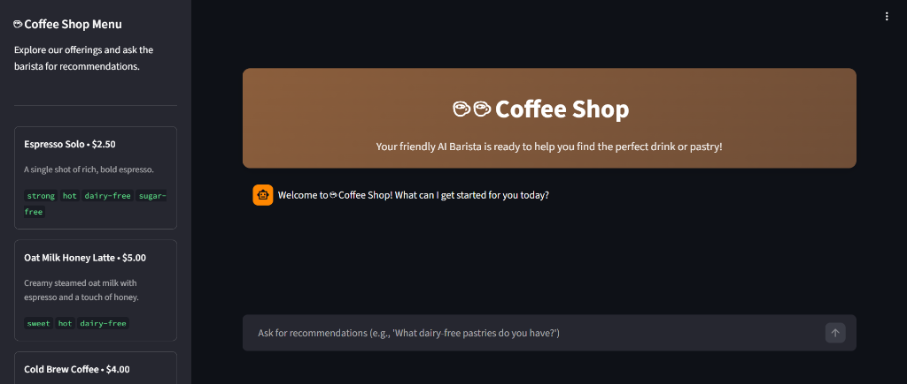
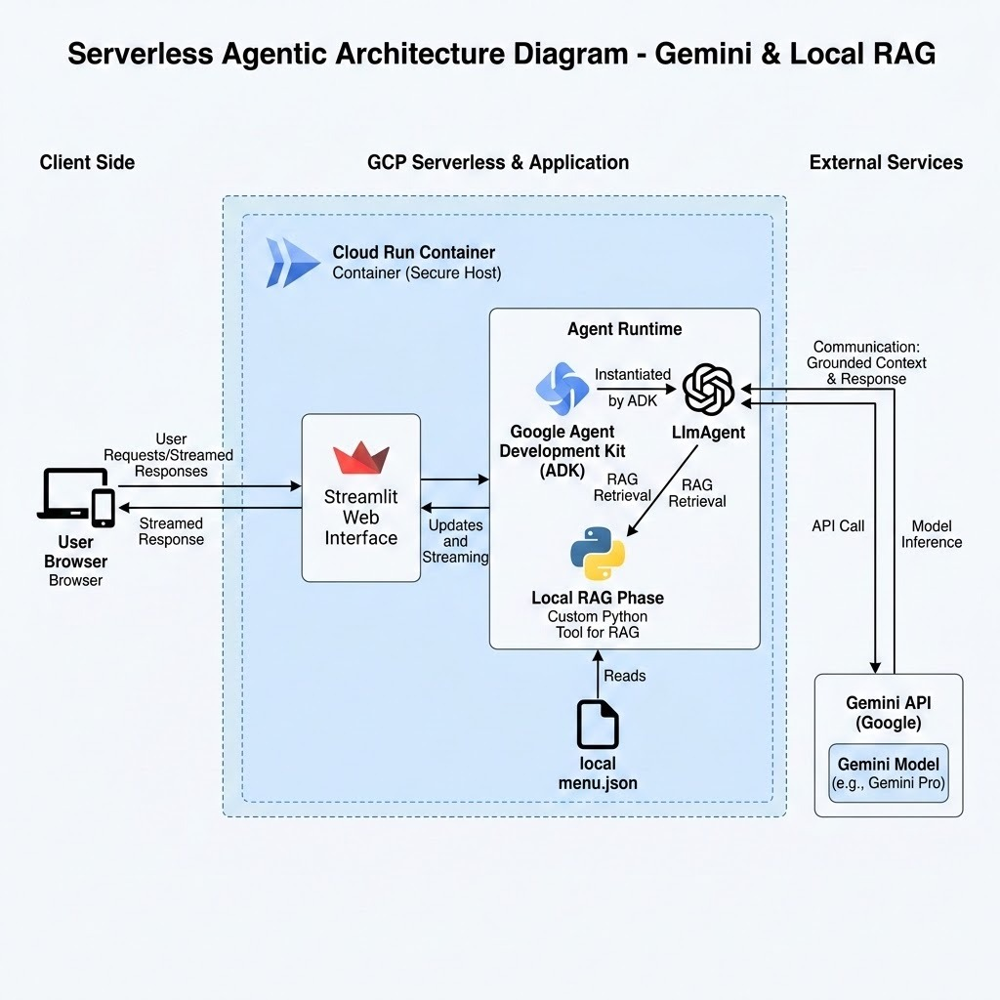
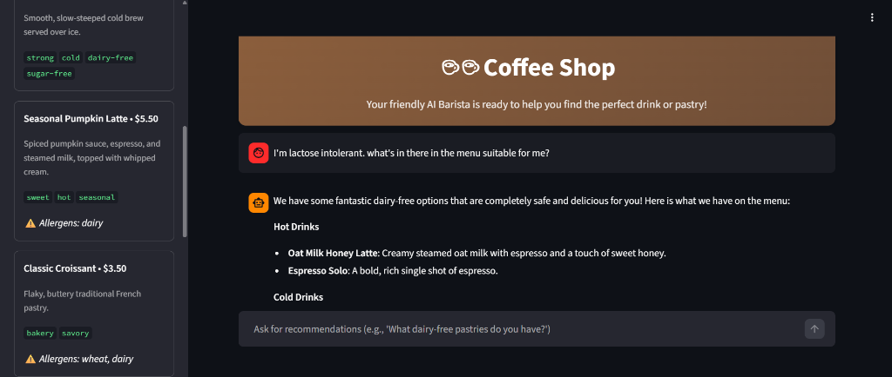
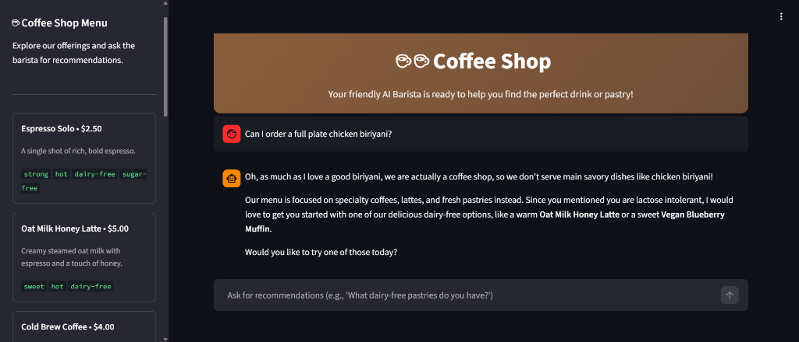
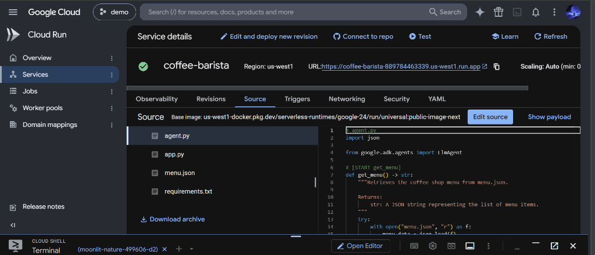

# ☕ Coffee Barista Agent

An AI-powered barista chatbot built with **Google's Agent Development Kit (ADK)** and **Streamlit**. The agent acts as a friendly coffee shop barista — recommending drinks and pastries from a real menu, handling dietary preferences, and politely declining off-menu requests.



---

## 🏗️ Architecture

The application follows a **serverless agentic architecture** using **Gemini & Local RAG**:



**How it works:**

1. The **User** interacts via a browser with the **Streamlit Web Interface**.
2. Streamlit communicates with the **Agent Runtime**, where the **Google ADK** instantiates an `LlmAgent`.
3. The agent uses a custom Python tool (`get_menu`) to perform **local RAG retrieval** — reading the menu data from `menu.json`.
4. The agent sends the grounded context to the **Gemini API** for model inference.
5. The response is streamed back through Streamlit to the user.

---

## ✨ Features

- **Menu-Grounded Recommendations** — The agent only recommends items present in the actual `menu.json`, preventing hallucinated suggestions.
- **Dietary & Allergen Awareness** — Understands tags like `dairy-free`, `vegan`, `sugar-free` and allergen info to filter recommendations for users with dietary restrictions.
- **Off-Menu Rejection** — Politely declines requests for items not on the coffee shop menu.
- **Interactive Sidebar Menu** — Displays the full menu with prices, descriptions, tags, and allergen warnings in the sidebar.
- **Conversational Chat Interface** — Maintains chat history for a natural, multi-turn conversation experience.

---

## 📸 Screenshots

### Dietary Filtering
> *User asks for lactose-free options — the agent filters the menu and recommends only dairy-free items.*



### Off-Menu Request Handling
> *User asks for chicken biriyani — the agent politely explains it's a coffee shop and redirects to available items.*



### Cloud Run Deployment
> *The agent deployed as a Cloud Run service on Google Cloud Platform.*



---

## 📁 Project Structure

```
coffee-barista-agent/
├── agent.py            # ADK agent definition with LlmAgent & get_menu tool
├── app.py              # Streamlit frontend with chat interface & sidebar menu
├── menu.json           # Coffee shop menu data (drinks & pastries)
├── requirements.txt    # Python dependencies
├── screenshots/        # Project screenshots & architecture diagram
│   ├── agent-welcome.png
│   ├── agent-dietary-filter.png
│   ├── agent-off-menu.png
│   ├── cloud-run-deployment.png
│   └── architecture-diagram.jpg
└── .gitignore
```

---

## 🚀 Getting Started

### Prerequisites

- Python 3.10+
- A Google Cloud project with the Gemini API enabled
- A valid `GOOGLE_API_KEY` environment variable set

### Installation

1. **Clone the repository:**
   ```bash
   git clone https://github.com/mayursureshnair/coffee-barista-agent.git
   cd coffee-barista-agent
   ```

2. **Create a virtual environment and install dependencies:**
   ```bash
   python -m venv venv
   source venv/bin/activate    # On Windows: venv\Scripts\activate
   pip install -r requirements.txt
   ```

3. **Set your API key:**
   ```bash
   export GOOGLE_API_KEY="your-api-key-here"   # On Windows: set GOOGLE_API_KEY=your-api-key-here
   ```

4. **Run the app:**
   ```bash
   streamlit run app.py
   ```

5. Open your browser and navigate to `http://localhost:8501`.

---

## 🛠️ Tech Stack

| Technology | Purpose |
|---|---|
| **Google ADK** (`google-adk`) | Agent framework for building the LLM-powered barista |
| **Gemini 3.5 Flash** | Large Language Model for natural language understanding & generation |
| **Streamlit** | Web UI framework for the chat interface |
| **Python** | Core programming language |
| **Google Cloud Run** | Serverless deployment platform |

---

## 📝 License

This project is open source and available for learning and experimentation.

---

> [!NOTE]
> **Cloud Run Deployment:** This AI agent was deployed and tested on **Google Cloud Run** as a serverless container service. The deployment has since been deleted after successful testing. The Cloud Run screenshot above is from the live deployment during testing.
